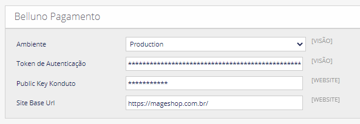

# Belluno + Mageshop

|  |  |  |
| --- | --- | --- |
| ANTIFRAUDE INCLUSO | TAXAS EXCLUSIVAS | CHECKOUT TRANSPARENTE |

[](https://www.php.net/)
[](https://docs.magento.com/m1/ce/user_guide/magento/magento-archive.html)
[](https://openmage.github.io/)
[](https://app.belluno.digital/)
[](#)

Extensão de pagamento Belluno para Magento 1.9 (Community Edition) e OpenMage LTS. Permite finalizar pedidos via Cartão de Crédito, Boleto Bancário, Pix e Link de pagamento, com antifraude integrado (Konduto) e checkout transparente.

## Sumário

- [Compatibilidade](#compatibilidade)
- [Requisitos](#requisitos)
- [Métodos suportados](#métodos-suportados)
- [Instalação](#como-instalar-a-extensão-de-pagamento-belluno-para-o-magento-19)
- [Webhook (postback)](#webhook-postback)
- [Configuração de logs](#configuração-de-logs)
- [Troubleshooting](#troubleshooting)
- [Como contribuir](#como-contribuir)
- [Suporte](#suporte)

## Compatibilidade

| Item | Versão |
| --- | --- |
| Magento | 1.9.x Community |
| OpenMage LTS | 19.x / 20.x |
| PHP | 7.2 – 8.3 (recomendado 7.4+ ou 8.x via OpenMage) |
| API Belluno | v2 |
| Moeda | BRL (Real) |
| Ambientes | Sandbox e Produção |

## Requisitos

- Loja Magento 1.9.x **ou** OpenMage LTS instalada e em funcionamento
- Token de autenticação Belluno (gerado no painel Belluno Digital)
- Chave pública Konduto (para tokenização de cartão em Cartão de Crédito)
- Extensão PHP cURL habilitada
- Acesso HTTPS válido (necessário para webhooks)

## Métodos suportados

| Método | Código | Recursos |
| --- | --- | --- |
| Cartão de Crédito | `belluno_creditcard` | Parcelamento configurável, juros por parcela, antifraude Konduto, captura opcional de CPF/CNPJ |
| Boleto Bancário | `belluno_bankslip` | Dias para vencimento configuráveis, linha digitável e PDF, captura opcional de CPF/CNPJ |
| Pix | `belluno_pix` | QR Code, copia e cola, atualização em tempo real via Websocket (opcional), captura opcional de CPF/CNPJ |
| Link de pagamento | `belluno_link` | Apenas backend (admin); seleção de métodos permitidos (Cartão / Pix) |

## Como instalar a extensão de pagamento Belluno para o Magento 1.9

### 1° Baixar arquivos
- Adicione os arquivos dentro do repositório público da sua loja Magento 1.9.

 

### 2° Atualizar o Cache
Admin Magento 1.9:
- Sistema > Gerenciamento de Cache > Selecionar Todos > Ação = Atualizar > Enviar
- Faça logout
- Login novamente

### 3° Configurar o Pagamento
Admin Magento 1.9:
- Sistema > Configuração > Método de Pagamento > Belluno Pagamento
- Selecione o **Ambiente** (Sandbox para testes / Produção)
- Informe o **Token de Autenticação**
- Informe a **Public Key Konduto** (necessária apenas para Cartão de Crédito)
- Informe a **Site Base Url** (ex: `https://minhaloja.com.br/`)
- Ative os métodos desejados (Cartão, Boleto, Pix, Link)

 

## Webhook (postback)

A Belluno notifica a loja quando há mudança de status do pagamento. A URL do webhook é construída automaticamente:

```
{base_url}/belluno/webhook/postback
```

Onde `{base_url}` é a URL pública da loja (obrigatório HTTPS em produção). Não é necessário configurar manualmente — o módulo envia a URL em cada transação via campo `postback.url`.

Status mapeados (Belluno → Magento):

| Status Belluno | Ação no Magento |
| --- | --- |
| `Paid` | Cria invoice e move o pedido para Processing |
| `Manual Analysis`, `Client Manual Analysis` | Move o pedido para Holded |
| `Refused`, `Expired`, `Inactivated`, `Cancelled`, `Closure *`, `Expired User Analysis` | Cancela o pedido |

Existe também o endpoint `belluno/consult` (botão "Força atualização do pedido" no admin) que consulta a Belluno sob demanda e aplica a mesma lógica.

## Configuração de logs

Em **Sistema > Configuração > Método de Pagamento > Belluno Pagamento > Gravar logs** é possível escolher:

- **Não gerar log**
- **Gerar log transação** — registra apenas as transações enviadas/recebidas
- **Gerar log de todos os eventos** — registra também postbacks, consultas, websocket e reembolsos

Arquivos gerados (em `var/log/`):

| Arquivo | Conteúdo |
| --- | --- |
| `mageshop_belluno.log` | Requisições e respostas da API Belluno |
| `mageshop_belluno_postback.log` | Payload bruto recebido nos webhooks |
| `mageshop_belluno_postback_callback.log` | Resposta da consulta enviada após o webhook |
| `mageshop_belluno_error_postback.log` | Erros durante o processamento do webhook |
| `mageshop_belluno_cancel.log` | Cancelamentos disparados pelo Magento |
| `mageshop_belluno_refund.log` | Reembolsos via creditmemo |
| `mageshop-belluno-payment-force-admin.log` | Consultas via "Força atualização do pedido" |
| `belluno-payment-websocket.log` | Atualizações em tempo real do Pix |

## Troubleshooting

| Mensagem / Sintoma | Causa provável | Como resolver |
| --- | --- | --- |
| "Algo não ocorreu bem. Por favor verifique suas informações." | Falha no envio à API (status fora da faixa 200, exceto 422) | Verifique token, ambiente, conectividade. Habilite logs e revise `mageshop_belluno.log`. |
| "Algo não ocorreu bem. Por favor verifique suas informações ou altere a forma de pagamento." | Resposta da Belluno retornou `message` ou `errors` | Veja o detalhe em `mageshop_belluno.log` — geralmente CPF/CNPJ inválido, endereço incompleto ou cartão recusado. |
| "card_hash não pode ser vazio. Por favor, atualize a página e tente novamente!" | A tokenização RSA do cartão (`/transaction/card_hash_key`) falhou no frontend | Atualize a página, confira a Public Key Konduto e a Site Base Url; certifique-se que o cliente preenche número, validade e CVV antes de submeter. |
| "Região Inaválida. Verifique por favor." | Estado do endereço não bate com nenhuma UF brasileira | Confira o cadastro do estado/região no endereço de cobrança e entrega. |
| "Customer cellphone not filled in or invalid!" | Telefone do cliente com menos de 9 dígitos | Confira o cadastro do cliente / o preenchimento do checkout. |
| Pedido fica em Pending após pagamento confirmado | Webhook não chegou (HTTPS inválido, firewall, URL base errada) | Use o botão "Força atualização do pedido" no admin. Verifique a Site Base Url e o acesso HTTPS público. |
| Linha digitável vazia no admin (Boleto) | `additional_information` corrompido ou pedido criado antes do fix do template admin | Após atualizar a extensão, novos pedidos exibem corretamente. Pedidos antigos podem ter dados inconsistentes. |
| QR Code do Pix não aparece no admin | Status do pagamento já não é mais `Open` (já pago/expirado) | Comportamento esperado — o QR só é exibido enquanto o Pix está aberto. |
| Múltiplos cancelamentos / reembolsos automáticos | Cancelamento do pedido + creditmemo dispararam refund duplo na Belluno | A partir desta versão, o módulo marca `belluno_refunded=true` no payment após o primeiro refund bem-sucedido e ignora chamadas seguintes. Verifique os logs `mageshop_belluno_refund.log` e `mageshop_belluno_cancel.log` se suspeitar de algo. |

## Como contribuir

1. Faça um fork deste repositório.
2. Crie uma nova branch: `git checkout -b minha-nova-feature`
3. Faça as alterações desejadas no código.
4. Faça o commit das suas alterações: `git commit -m 'Adiciona nova feature'`
5. Faça o push para o repositório remoto: `git push origin minha-nova-feature`
6. Envie um Pull Request.

## Suporte

- Painel Belluno: [app.belluno.digital](https://app.belluno.digital/)
- MageShop: [mageshop.com.br](https://mageshop.com.br/)
- Para dúvidas técnicas, abra uma issue neste repositório informando: versão do Magento, versão do PHP, método de pagamento envolvido e trechos relevantes dos logs em `var/log/`.
